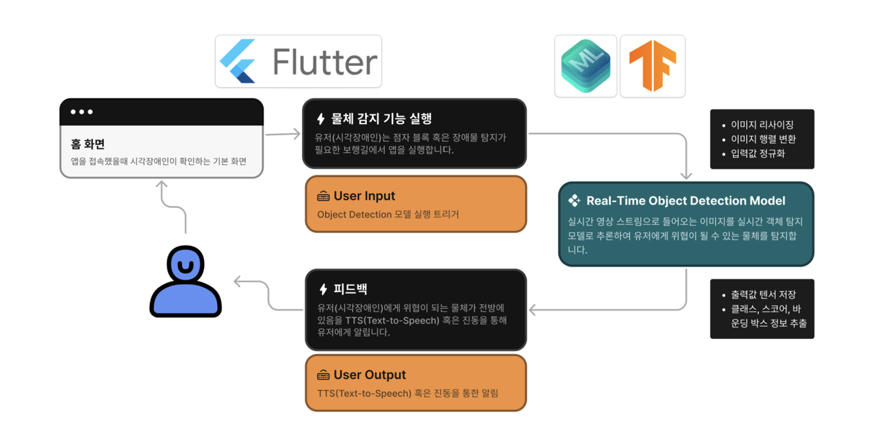

  

 

 

## 📖 프로젝트 개요 (Overview)

시각장애인의 안전한 보행을 돕는 **On-Device AI 기반 모바일 애플리케이션**  

**기간** 2024.11 - 2024.12  
**인원** 4인

  

 

## 🚀 주요 기술 및 특징 (Key Technologies & Features)

  

 

## 🏛️ 앱 서비스 구조 (App Service Architecture)

  

 

## 🛠️ 기술 스택 (Tech Stack)

| 구분                | 기술                                                                     |
| :------------------ | :----------------------------------------------------------------------- |
| **Hardware & OS**   | `Ubuntu 24.04 LTS`, `Nvidia RTX 4070Ti Super`                            |
| **Languages**       | `Python`, `Dart`                                                         |
| **Frameworks**      | `Flutter`, `PyTorch`, `Tensorflow`                                       |
| **Analysis Libs**   | `OpenCV`, `Numpy`, `Pandas`, `Ultralytics`                               |
| **Mobile AI**       | `CoreML`, `TFLite`                                                       |
| **Tools**           | `Github`, `Docker`, `Jupyter`, `Roboflow`, `Notion`                      |

 

## 🤖 모델링 과정 (Modeling Process)

최적의 On-Device AI 모델을 선정하기 위해 체계적인 데이터 구축 및 모델 성능 비교/평가 과정을 거쳤습니다.

### 1. 데이터 구축 및 분석 (Data)
- **데이터 수집**: `AI-Hub`의 공공 데이터, `Roboflow`의 오픈 데이터셋, 그리고 팀원들이 직접 촬영한 데이터를 모두 활용하여 총 5,310장의 최종 데이터셋을 구축했습니다.
- **데이터 전처리**: 라벨링 오류를 직접 검수하고, 다양한 환경에서의 강인한 성능을 위해 데이터 증강(Augmentation)을 적용했습니다.

### 2. 모델 선정 및 평가 (Model)
- **후보 모델**: 모바일 환경에서의 성능을 고려하여 `YOLO`, `RT-DETR`, `SSD MobileNet V2`, `EfficientDet` 등 경량화된 모델들을 주요 후보로 선정했습니다.
- **성능 평가**: 테스트 데이터셋 기반의 mAP 평가와 실제 애플리케이션 탑재 후의 추론 속도(ms, FPS), GPU 사용량을 종합적으로 비교/분석했습니다.
- **최종 선정**: **YOLOv8n** 모델이 정확도, 속도, 리소스 효율성 모든 면에서 가장 뛰어난 성능을 보여 최종 모델로 선정되었습니다. 양자화(Quantization)를 통해 추가적인 성능 개선도 확인했습니다.

 

## 🤔 회고 (4L Retrospective)

-   **👍 Liked (좋았던 점)**
    -   매일 진행한 회의를 통해 막힘없는 소통과 빠른 문제 해결
    -   On-Device AI라는 새로운 분야에 대한 깊이 있는 경험

-   **💧 Lacked (부족했던 점)**
    -   프로젝트 기간의 한계로 인해 구현하고 싶었던 추가 기능들을 모두 시도하지 못한 아쉬움이 있음

-   **💡 Learned (배운 점)**
    -   YOLO, EfficientDet 등 다양한 객체 탐지 모델의 아키텍처와 장단점에 대한 깊은 학습
    -   데이터의 질과 양이 모델 성능에 미치는 영향을 체감하고, 체계적인 데이터 구축의 중요성을 배움

-   **🙏 Longed For (바라는 점)**
    -   지속적인 리팩토링을 통해 코드의 안정성과 효율성을 높이고 싶음
    -   객체 탐지뿐만 아니라, GPS와 연동한 경로 안내 등 추가적인 기능을 디벨롭하여 서비스 완성도를 높이고 싶음

 

## 👨‍💻 팀원 (Team ILJO)

| 이름   | 역할                                        |
| :----- | :------------------------------------------ |
| **정현우** | 팀장, 외부 데이터 수집, 데이터 가공 및 분석, `EfficientDet` 모델 개발 |
| **김현우** | 데이터 검수, `YOLOv8`, `RT-DETR` 모델 개발 |
| **장수연** | 데이터 검수, `SSD + MobileNet v2` 모델 개발 |
| **최원혁** | 앱 개발, `ML Object Detector` 모델 개발      |
